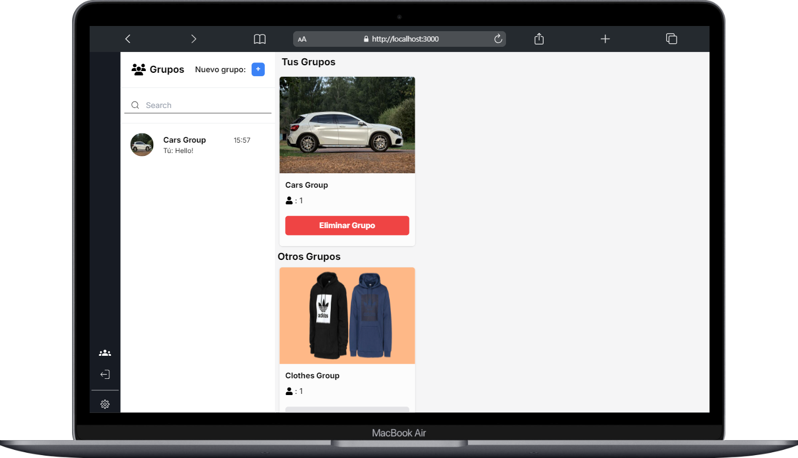
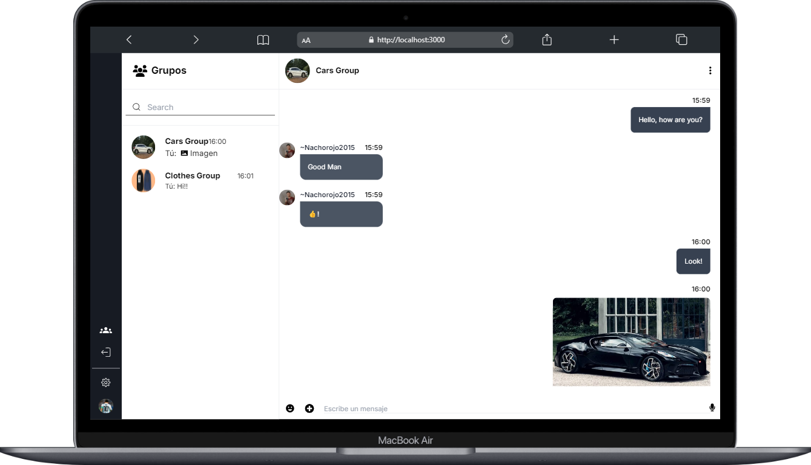
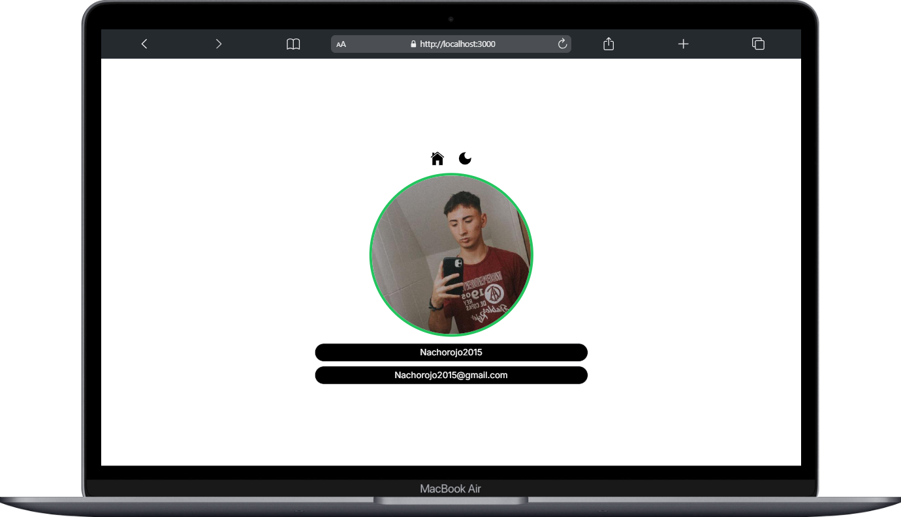
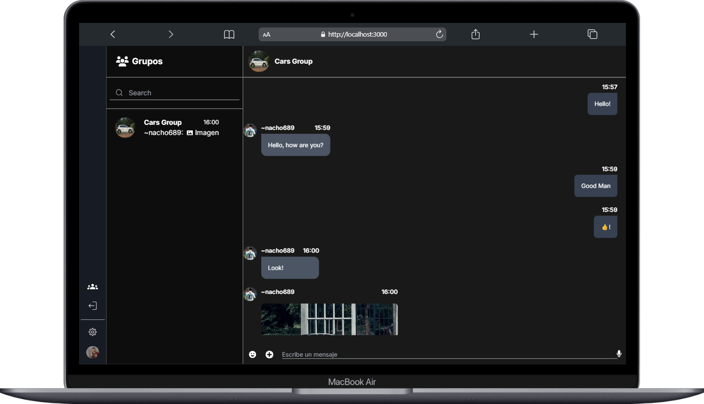
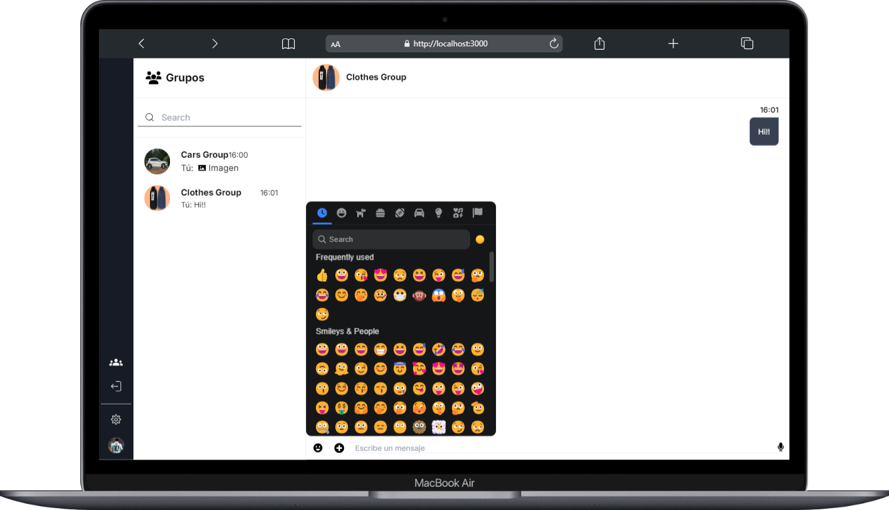
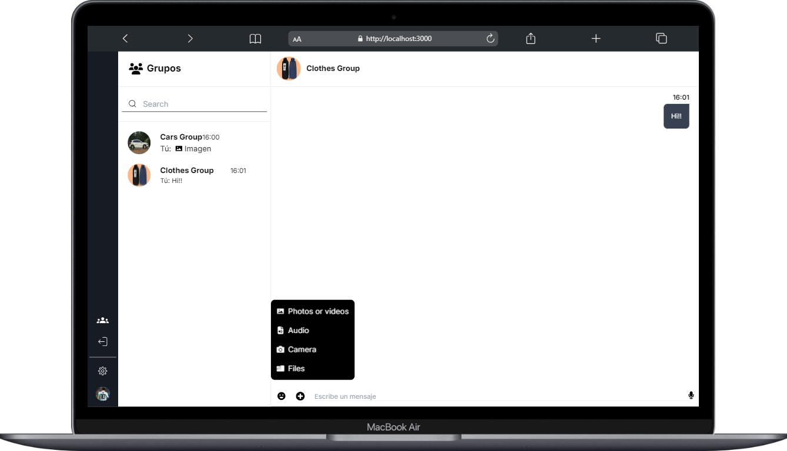

# Chat Grupal

> ¿Qué es Chat Grupal?

<p>Chat grupal es una web creada con el fin de que los usuarios puedan unirse a grupos de sus preferencias y empezar a hablar con otros usuarios. Con múltiples funcionalidades como compartir Videos, Imágenes, Documentos, Tomar fotos, Etc. Mejorando la experiencia y la calidad de la app.</p>

> ¿Qué funcionalidades tiene Chat Grupal?

<p>Chat Grupal cuenta con todo tipo de funcionalidades tipicas de un Chat, entre ellas estan:</p>

- Crear Grupos.
- Unirse a Grupos.
- Abandonar / Eliminar Grupos.
- Enviar mensajes de Texto, Audio, Video o Imágen.
- Compartir archivos (Videos, Imágenes, Documentos, Audios).
- Tomar fotos y subirlas directamente a la aplicación.
- Ver los mensajes que se han enviado en el grupo.
- Borrar Mensajes.
- Incluye Emojis.
- Modo oscuro.
- Incluye un buscador para buscar grupos en los que formas parte.
- Cambiar foto de perfil.
- Posibilidad de iniciar sesión con Github o Discord.

> ¿Para que dispositivos esta disponible Chat Grupal?

<p>Por el momento, Chat grupal esta adaptado para Pc / Portables. El sitio no cuenta con un diseño responsive, mientras tanto esa parte esta en desarrollo y pronto se podrá utilizar.</p>

> ¿Cuántos usuarios pueden participar en un Chat?

<p>Chat Grupal no cuenta con un límite de usuarios, cualquiera puede unirse a un grupo y empezar a mensajear.</p>

> ¿Es posible realizar llamadas de voz y video dentro de Chat Grupal?

<p>Chat grupal no cuenta con una funcionalidad para realizar llamadas o videollamadas.</p>

> ¿Cuál es la ventaja de utilizar Chat Grupal?

<p>Chat grupal funciona en tiempo real, con poco tiempo de espera, fácil de usar, gratuita, múltiples funcionalidades y muy eficiente. Es una buena alternativa a otras aplicaciones.</p>

> ¿Qué innovaciones o características futuras están planeadas para Chat Grupal?

<p>Chat grupal todavía se encuentra en desarrollo y se esperan muchas funciones nuevas para el futuro. Entre ellas agregar: </p>

- Diseño para dispositivos Móviles.
- Posibilidad de que un Admin pueda eliminar usuarios de su grupo.
- Posibilidad de editar un Grupo.
- Posibilidad de crear un grupo privado.
- Agregar nuevos estilos y darle un enfoque más minimalista a la web.

---

## Capturas del Sitio


<br>
<br>

<br>
<br>

<br>
<br>

<br>
<br>

<br>
<br>


---

### :pushpin: Como probar Chat Group en Local

> Primer paso: Clonar Proyecto

    git clone https://github.com/Nachorojo2015/Chat-Grupal.git

> [!NOTE]
> El proyecto cuenta con dos partes, un frontend y un backend. Empezaremos por el backend

> Segundo paso: Acceder a la carpeta "backend"

    cd backend

> Tercer paso: Crear un archivo .env en la raíz principal, copiar las variables y llenarlas con sus respecitivos valores

```
MONGO_URL = # Tu Url de Mongo // https://www.mongodb.com/es
SECRET_KEY = # Generar password random // https://www.lastpass.com/es/features/password-generator
GITHUB_CLIENT_ID = # Tu github client id // https://github.com
GITHUB_CLIENT_SECRET = # Tu github client secret // https://github.com
DISCORD_CLIENT_ID = # Tu discord client id // https://discord.com/developers/applications
DISCORD_CLIENT_SECRET = # Tu discord client secret // https://discord.com/developers/applications
```

> Cuarto paso: Instalar las dependencias del proyecto

    npm install

> [!TIP]
> Con eso terminariamos en el backend, ahora seguimos con el frontend

> Quinto paso: Acceder a la carpeta "frontend"

    cd frontend

> Sexto paso: Instalar las dependencias

    npm install

> Séptimo paso: Correr los dos proyectos

    npm run dev

> [!IMPORTANT]
> El último comando se debe ejecutar en los dos directorios, sino el proyecto no funcionará.

- Una vez inicializados los dos directorios dirigirse a "http://localhost:3000"

---

### :wrench: Principal Stack Utilizado

- [Next-Js](https://nextjs.org/)
- [Express](https://expressjs.com/)
- [MongoDB](https://www.mongodb.com/es)
- [Node.js](https://nodejs.org/es/)
- [React](https://es.reactjs.org/)
- [Zustand](https://zustand-demo.pmnd.rs/)
- [Sockets](https://socket.io/)

---

> Próximamente con nuevos cambios en Chat Grupal
